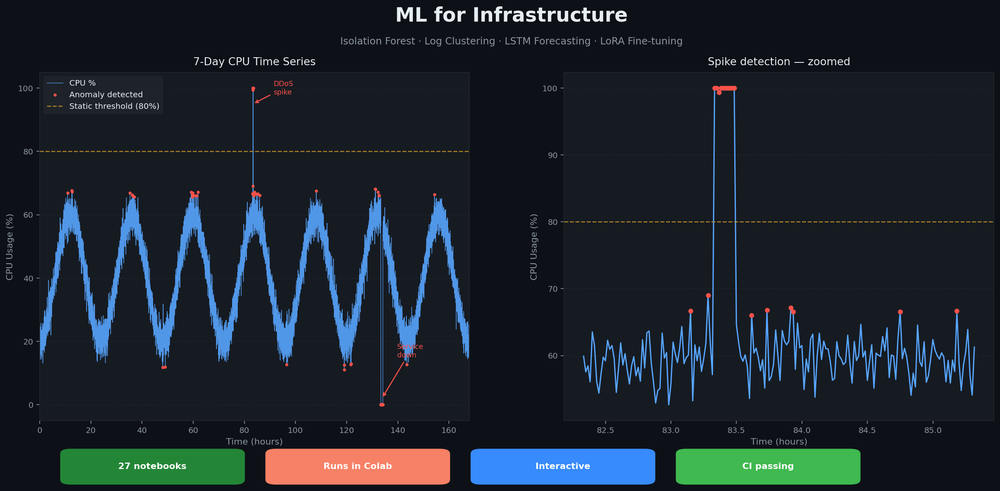

# 🧠 ML for Infrastructure



[](https://github.com/laban254/ml-for-infrastructure/actions/workflows/ci.yml)
[](https://www.python.org/)
[](#%EF%B8%8F-license)
[](https://colab.research.google.com/github/laban254/ml-for-infrastructure)

---

## 📚 Documentation
- [Getting Started](docs/GETTING-STARTED.md) — 5-minute quickstart
- [Setup & Installation](docs/SETUP.md) — detailed installation
- [Architecture](docs/ARCHITECTURE.md) — project structure and design
- [Contributing](docs/CONTRIBUTING.md) — how to contribute

---

## 🎯 What this is

27 Jupyter notebooks that teach machine learning through real infrastructure scenarios — not Iris, not Titanic. Every notebook uses data engineers actually deal with: CPU spikes, log streams, latency distributions shifting after a deploy, and model drift in production.

⭐ If this is useful, a star helps others find it.

---

## 🗂️ Capabilities

### 📡 Intelligent Monitoring (`03_machine_learning/` & `05_sre_applications/`)
*   **Anomaly Detection:** Isolation Forest on Prometheus-style CPU metrics — catches DDoS spikes and service outages without manual thresholds. Includes a live sensitivity slider.
*   **Log Clustering:** TF-IDF + KMeans groups unstructured logs by pattern, auto-names each cluster from its top keywords, and flags log lines that don't fit any known group.
*   **Predictive Scaling:** Regression model forecasts latency from connection-spike data before the slowdown hits users.

### ⚙️ MLOps & Production Pipelines
ML is only useful if it runs reliably in production.
*   **Leakage-Free Pipelines:** Preprocessing and model bundled together so training and serving use identical transformations.
*   **Precision over Accuracy:** Notebooks prioritize recall (missed outages) and precision (alert fatigue) — the metrics that matter on-call, not just overall accuracy.
*   **Hyperparameter Tuning:** GridSearchCV sweep over API timeout prediction, with inline results — no separate dashboard needed.

### 📊 Observability Visuals (`02_visualization/`)
Charts built for post-mortems and incident reviews, not presentations.
*   **RCA Dashboards:** Annotated plots with alert thresholds and OOM event markers that tell a story at a glance.
*   **Drift Detection:** KS-test flags when production latency has shifted significantly from the training distribution — interactive slider shows exactly where the significance threshold is crossed.

---

## 🔧 Automation & Tooling

### 📥 Data Fetching (`fetch_data.py`)
One script to fetch sample data with MD5 checksum verification.
```bash
python fetch_data.py --quick     # fetch small samples for fast iteration
python fetch_data.py --full      # fetch complete datasets for training
python fetch_data.py --verify    # verify data integrity against known hashes
```

### 🎛️ Execution Modes (`notebook_toggle.py`)
Switch between fast and full runs from the CLI or inside a notebook.
*   **Quick Mode:** 10% of data, 1/10th of iterations — useful for understanding the code without waiting.
*   **Full Mode:** Uses all CPU cores (`n_jobs=-1`) and complete datasets for production-grade results.

---

## 🚀 Run it live — zero install

Every notebook has **Open in Colab** and **Open in Binder** badges at the top — click one and it runs in a free cloud environment, nothing to install. Key notebooks include **interactive sliders** (tune the anomaly sensitivity, move the drift threshold, adjust the alert level) and **"Try it yourself" exercises** with reveal-on-click solutions.

> 📌 All notebooks are committed **with outputs already rendered** — you can read the full results, charts, and metrics directly on GitHub without running anything.

Best place to start:

| Scenario | Notebook | What you'll learn |
| --- | --- | --- |
| 🚨 Anomaly detection | [`prometheus_anomaly.ipynb`](05_sre_applications/anomaly_detection/prometheus_anomaly.ipynb) | Isolation Forest vs Z-score on CPU telemetry — interactive |
| 📉 Data drift | [`data_drift.ipynb`](05_sre_applications/model_monitoring/data_drift.ipynb) | KS-test drift detection — interactive |
| 🧮 NumPy foundations | [`numpy.ipynb`](01_foundations/numpy/numpy.ipynb) | Vectorised metric analysis — interactive |
| 🩺 Server health | [`classification.ipynb`](03_machine_learning/scikit-learn/supervised-learning-algorithms/classification.ipynb) | Multi-class triage with feature importance |

---

## ⚡ Quick Start (local)

1.  **Clone & install**
    ```bash
    git clone https://github.com/laban254/ml-for-infrastructure.git
    cd ml-for-infrastructure
    pip install -r requirements.txt            # core stack — runs most notebooks
    pip install -r requirements-deep.txt       # optional: keras, pytorch, pyspark, mlflow
    ```

2.  **Fetch sample data**
    ```bash
    python fetch_data.py --quick
    ```

3.  **Open a notebook**
    Start with `05_sre_applications/anomaly_detection/prometheus_anomaly.ipynb` — drag the sensitivity slider and watch the anomaly count change in real time.

---

## ⚖️ License

Distributed under the MIT license.
